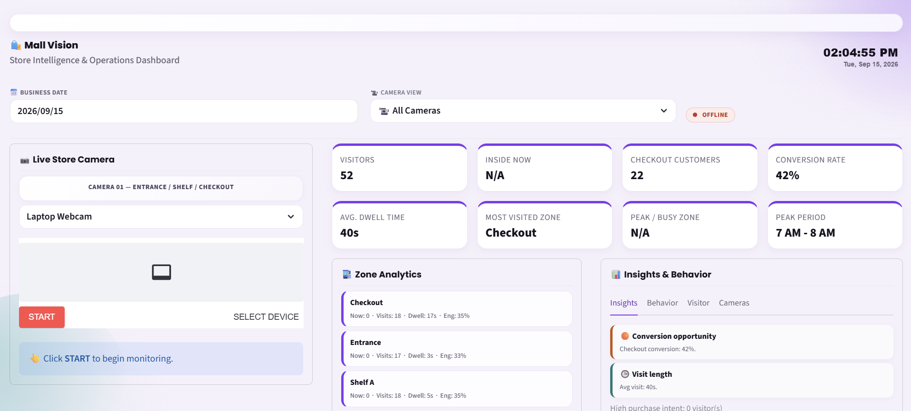
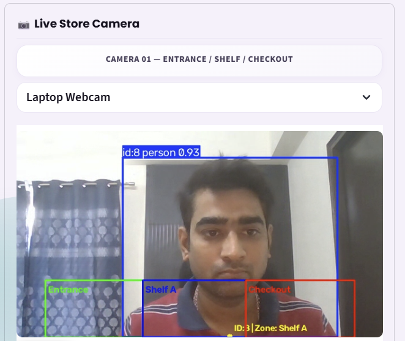
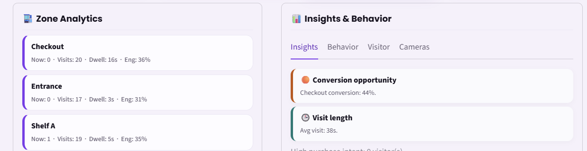
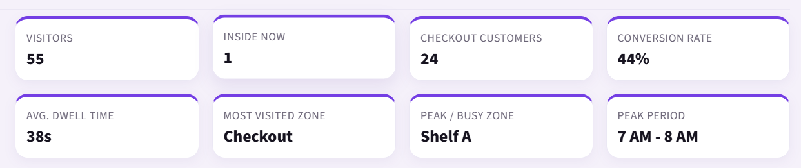

 
# 🏪 Smart Store Intelligence

> AI-powered retail analytics using computer vision, customer tracking, and machine learning.

Smart Store Intelligence is a real-time retail analytics system that analyzes customer movement inside a store using a live camera feed.

The system detects and tracks customers, identifies their movement across store zones, calculates dwell time, generates customer events, reconstructs customer journeys, and provides business insights through an interactive Streamlit dashboard.

---

## 🎯 Problem Statement

Traditional retail stores have limited visibility into how customers behave inside the store.

This project aims to answer questions such as:

- How many customers entered the store?
- Which zones receive the most attention?
- How long do customers spend in each zone?
- Which zones do customers visit?
- How do customers move between zones?
- How many customers reach checkout?
- Can customer behavior be used to predict checkout/conversion?

---

## 🚀 Key Features

### 👁️ Computer Vision

- Real-time person detection using YOLO
- Multi-object tracking using ByteTrack
- Persistent customer tracking across video frames
- Bounding-box based customer localization

### 📍 Zone Intelligence

The store is divided into logical zones:

- Entrance
- Shelf A
- Checkout

The customer's bottom-center / feet point is used to determine where the customer is physically standing.

```python
feet_point = ((x1 + x2) / 2, y2)
````

The feet point provides a better floor-position estimate for zone mapping than the center of the bounding box.

### 🧭 Customer Journey Tracking

The system tracks:

* Zone entries
* Zone transitions
* Zone exits
* Dwell time
* Customer paths
* Customer journey history

### ⚙️ Event Processing

Customer movement is converted into structured events:

* `ZONE_ENTRY`
* `ZONE_TRANSITION`
* `ZONE_EXIT`
* `LONG_DWELL`

These events are stored for further analysis.

### 📊 Store Analytics

The dashboard provides:

* Total customers
* Currently inside
* Checkout customers
* Conversion rate
* Most visited zone
* Average dwell time
* Zone engagement
* Zone transitions
* Customer journey information

### 🤖 Machine Learning

A Logistic Regression model is used as a baseline to predict whether pre-checkout customer behavior is associated with reaching checkout.

Features include:

* Total dwell time
* Shelf A dwell time
* Entrance dwell time
* Number of zones visited
* Number of zone transitions

Additional ML components include:

* Customer clustering
* Behavioral anomaly detection

---

# 🧠 System Architecture

```text
                 ┌─────────────────────┐
                 │    Camera/Webcam    │
                 └──────────┬──────────┘
                            │
                            ▼
                 ┌─────────────────────┐
                 │   YOLO Detection    │
                 └──────────┬──────────┘
                            │
                            ▼
                 ┌─────────────────────┐
                 │   ByteTrack         │
                 │   Tracking          │
                 └──────────┬──────────┘
                            │
                            ▼
                 ┌─────────────────────┐
                 │ Track ID +          │
                 │ Bounding Box        │
                 └──────────┬──────────┘
                            │
                            ▼
                 ┌─────────────────────┐
                 │ Feet Point          │
                 │ Localization        │
                 └──────────┬──────────┘
                            │
                            ▼
                 ┌─────────────────────┐
                 │ Zone Manager        │
                 │                     │
                 │ Entrance / Shelf A  │
                 │ / Checkout          │
                 └──────────┬──────────┘
                            │
                            ▼
                 ┌─────────────────────┐
                 │ Event Engine        │
                 └──────────┬──────────┘
                            │
                            ▼
                 ┌─────────────────────┐
                 │ SQLite EventStore   │
                 └──────────┬──────────┘
                            │
                  ┌─────────┴─────────┐
                  ▼                   ▼
        ┌──────────────────┐ ┌──────────────────┐
        │ Customer Journey │ │ Store Analytics  │
        │ Analyzer         │ │                  │
        └────────┬─────────┘ └────────┬─────────┘
                 │                    │
                 └──────────┬─────────┘
                            ▼
                 ┌─────────────────────┐
                 │    ML Analytics     │
                 │ Conversion /        │
                 │ Clustering /        │
                 │ Anomaly Detection   │
                 └──────────┬──────────┘
                            │
                            ▼
                 ┌─────────────────────┐
                 │ Streamlit Dashboard │
                 └─────────────────────┘
```

---

# 🖥️ Dashboard

The dashboard provides a live view of store operations, customer movement, and business analytics.

## 📸 Screenshots

### Main Dashboard



### Live Camera



### Store Analytics



### Customer Journey



---

# 🛠️ Tech Stack

| Technology         | Purpose               |
| ------------------ | --------------------- |
| Python             | Core application      |
| YOLO / Ultralytics | Person detection      |
| ByteTrack          | Multi-object tracking |
| OpenCV             | Computer vision       |
| Streamlit          | Dashboard             |
| Streamlit-WebRTC   | Live browser camera   |
| SQLite             | Event storage         |
| Pandas             | Data processing       |
| NumPy              | Numerical processing  |
| Scikit-learn       | Machine learning      |

---

# 📁 Project Structure

```text
smart_store_intelligence/
│
├── dashboard.py
├── requirements.txt
├── README.md
├── .gitignore
│
├── models/
│   └── customer_conversion_model.pkl
│
├── screenshots/
│   ├── dashboard.png
│   ├── live-camera.png
│   ├── analytics.png
│   └── customer-journey.png
│
├── src/
│   ├── detection.py
│   ├── zone_manager.py
│   ├── event_engine.py
│   ├── event_store.py
│   ├── customer_journey.py
│   ├── store_analytics.py
│   ├── video_source.py
│   │
│   └── ml/
│       ├── feature_engineering_v2.py
│       ├── train.py
│       ├── predict.py
│       ├── check_dataset.py
│       ├── anomaly_detection.py
│       └── customer_clustering.py
│
└── tests/
    ├── test_events.py
    └── test_journey.py
```

---

# ⚙️ Installation

Clone the repository:

```bash
git clone YOUR_REPOSITORY_URL
cd smart_store_intelligence
```

Create a virtual environment:

```powershell
python -m venv .venv
```

Activate it:

```powershell
.venv\Scripts\activate
```

Install dependencies:

```powershell
pip install -r requirements.txt
```

Place the required YOLO model in the project root:

```text
yolo26n.pt
```

---

# ▶️ Run the Dashboard

```powershell
streamlit run dashboard.py
```

Open:

```text
http://localhost:8501
```

---

# 🧪 Dataset Check

```powershell
python -m src.ml.check_dataset
```

---

# 🤖 Train / Retrain the Conversion Model

```powershell
python -m src.ml.train
```

The conversion model is a baseline model and should not be considered production-ready when trained on a small dataset.

---

# 🧪 Run Tests

```powershell
python -m pytest tests
```

---

# 📍 Zone Configuration

The current implementation uses a `640 × 360` processing frame.

```text
Entrance
(50, 260) → (220, 360)

Shelf A
(220, 260) → (400, 360)

Checkout
(400, 260) → (590, 360)
```

These coordinates can be changed in:

```text
src/zone_manager.py
```

depending on the camera view.

---

# 🧮 ML Feature Engineering

The conversion model uses only pre-checkout customer behavior:

```text
1. total_dwell
2. shelf_a_dwell
3. entrance_dwell
4. zones_visited
5. transitions
```

Checkout dwell time is intentionally excluded because checkout is the target outcome. Including checkout dwell could introduce target leakage.

---

# 💼 Business Value

The system is designed to help store owners understand:

* Customer traffic
* Customer movement
* Zone popularity
* Customer dwell time
* Checkout behavior
* Store engagement
* Customer journeys
* Behavioral patterns

These insights can potentially support:

* Store layout optimization
* Product placement decisions
* Staff allocation
* Customer experience improvement
* Checkout optimization

---

# 📅 Historical Analytics

The dashboard architecture supports date-wise store analytics so owners can compare business activity across different days.

Future reporting can include:

* Daily visitors
* Daily checkout customers
* Conversion rate
* Average dwell time
* Zone performance
* Customer journeys
* Peak periods

---

# 📹 Future Multi-Camera Architecture

The current implementation focuses on a single camera, but the system is designed to evolve toward multi-camera retail monitoring.

Future architecture:

```text
Camera 1 ──┐
Camera 2 ──┤
Camera 3 ──┼──> Central Event Store
Camera 4 ──┘          │
                      ▼
               Unified Analytics
                      │
                      ▼
               Store Dashboard
```

Each camera can have its own:

* Camera ID
* Tracking IDs
* Zone configuration
* Video stream

Future cross-camera customer identification can use a global customer ID and Re-ID system.

---

# 🔮 Future Improvements

* Multi-camera support
* Camera-specific zone configuration
* Cross-camera customer Re-ID
* Global customer IDs
* Centralized event processing
* PostgreSQL for production-scale storage
* Cloud deployment
* Advanced retail forecasting
* More real-world training data
* Historical business reports

---

# ⚠️ Current Limitations

* Current implementation primarily focuses on a single camera.
* Customer identity across separate cameras is not currently guaranteed.
* Conversion prediction is a baseline model and requires more real-world data.
* Zone coordinates are currently configured for a specific camera view.
* WebRTC camera behavior can depend on the local browser and network environment.

---

# 👨‍💻 Author

**Abhishek Sharma**

AI / Machine Learning / Computer Vision

Built as an end-to-end retail intelligence project combining computer vision, real-time event processing, analytics, and machine learning.

```
 
